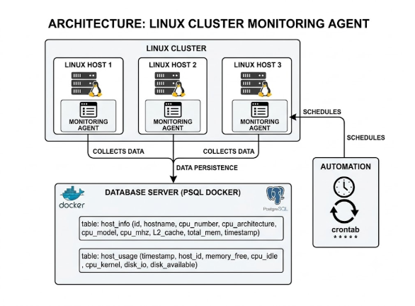
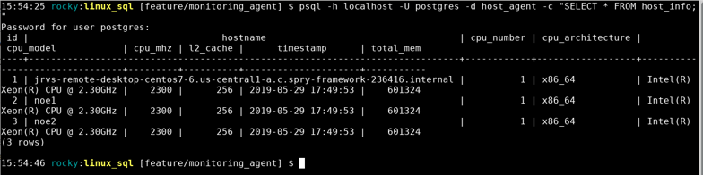
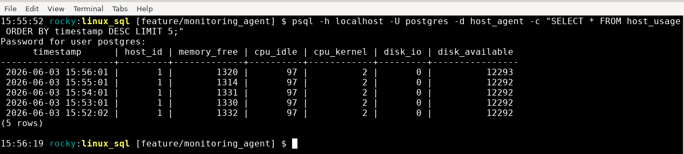

markdown
# Linux Cluster Monitoring Agent

## Introduction

The Linux Cluster Monitoring Agent is a lightweight, automated solution designed to track the hardware specifications and real-time resource utilization of servers within a Linux cluster. The system addresses a concrete operational need: giving infrastructure teams continuous, structured visibility into their nodes' health without relying on heavyweight third-party tools.

The architecture is agent-based. Each node in the cluster runs a pair of Bash scripts that collect system metrics and forward them to a centralized PostgreSQL instance provisioned inside a Docker container. Hardware inventory is captured once at provisioning time, while usage telemetry is collected at one-minute intervals via crontab. The stack is intentionally minimal  Bash for portability, Docker for environment isolation and reproducibility, and PostgreSQL for structured, queryable persistence  making the agent deployable on any standard Linux host without additional dependencies.

---

## Quick Start

### 1. Provision the PostgreSQL Container

```bash
# Create and start the psql Docker container
./scripts/psql_docker.sh create <db_username> <db_password>

# Start an existing (stopped) container
./scripts/psql_docker.sh start

# Stop a running container
./scripts/psql_docker.sh stop
```


Proof of execution:

bash
rocky:linux_sql [feature/monitoring_agent] $ ./scripts/psql_docker.sh create
? docker.service - Docker Application Container Engine
     Loaded: loaded (/usr/lib/systemd/system/docker.service; enabled; preset: disabled)
     Active: active (running) since Tue 2026-06-02 13:08:44 UTC; 1 day 2h ago
TriggeredBy: ? docker.socket
       Docs: https://docs.docker.com
   Main PID: 963 (dockerd)
      Tasks: 26
     Memory: 131.6M (peak: 133.6M)
        CPU: 15.100s
     CGroup: /system.slice/docker.service
             +- 963 /usr/bin/dockerd -H fd:// --containerd=/run/containerd/containerd.sock
             +-33458 /usr/bin/docker-proxy -proto tcp -host-ip 0.0.0.0 -host-port 5432 -container-ip 172.17.0.2 -container-po>
             +-33464 /usr/bin/docker-proxy -proto tcp -host-ip :: -host-port 5432 -container-ip 172.17.0.2 -container-port 54>

rocky:linux_sql [feature/monitoring_agent] $ docker ps -f name=jrvs-psql
CONTAINER ID   IMAGE                 COMMAND                  CREATED      STATUS        PORTS                                         NAMES
88ea7ef17f1f   postgres:9.6-alpine   "docker-entrypoint.s?"   6 days ago   Up 26 hours   0.0.0.0:5432->5432/tcp, [::]:5432->5432/tcp   jrvs-psql
2. Initialize the Database Schema
bash
# Connect to the psql instance and create the host_agent database
psql -h localhost -U postgres -c "CREATE DATABASE host_agent;"

# Execute the DDL script to create tables
psql -h localhost -U postgres -d host_agent -f sql/ddl.sql
Proof of execution:

bash
rocky:linux_sql [feature/monitoring_agent] $ psql -h localhost -U postgres -d host_agent -c "\dt"
Password for user postgres: 
           List of relations
 Schema |    Name    | Type  |  Owner   
--------+------------+-------+----------
 public | host_info  | table | postgres
 public | host_usage | table | postgres
(2 rows)
3. Collect Hardware Specifications (run once per host)
bash
./scripts/host_info.sh <psql_host> <psql_port> <db_name> <psql_user> <psql_password>

# Example
./scripts/host_info.sh localhost 5432 host_agent postgres password
Proof of execution:

bash
rocky:linux_sql [feature/monitoring_agent] $ psql -h localhost -U postgres -d host_agent -c "SELECT * FROM host_info;"
Password for user postgres: 
 id |                                   hostname                                   | cpu_number | cpu_architecture |                cpu_model            | cpu_mhz | l2_cache |      timestamp      | total_mem 
----+------------------------------------------------------------------------------+------------+------------------+--------------------------------------+---------+----------+---------------------+-----------
  1 | jrvs-remote-desktop-centos7-6.us-central1-a.c.spry-framework-236416.internal |          1 | x86_64           | Intel(R) Xeon(R) CPU @ 2.30GHz       |    2300 |      256 | 2019-05-29 17:49:53 |    601324
  2 | noe1                                                                         |          1 | x86_64           | Intel(R) Xeon(R) CPU @ 2.30GHz       |    2300 |      256 | 2019-05-29 17:49:53 |    601324
  3 | noe2                                                                         |          1 | x86_64           | Intel(R) Xeon(R) CPU @ 2.30GHz       |    2300 |      256 | 2019-05-29 17:49:53 |    601324
(3 rows)
4. Collect Resource Usage (run once to verify, then automate)
bash
bash scripts/host_usage.sh <psql_host> <psql_port> <db_name> <psql_user> <psql_password>

# Example
bash scripts/host_usage.sh localhost 5432 host_agent postgres password
Proof of execution:

bash
15:48:00 rocky:linux_sql [feature/monitoring_agent] $ psql -h localhost -U postgres -d host_agent -c "SELECT * FROM host_usage;"
Password for user postgres: 
      timestamp      | host_id | memory_free | cpu_idle | cpu_kernel | disk_io | disk_available 
---------------------+---------+-------------+----------+------------+---------+----------------
 2019-05-29 15:00:00 |       1 |      300000 |       90 |          4 |       2 |              3
 2019-05-29 15:01:00 |       1 |      200000 |       90 |          4 |       2 |              3
 2026-06-02 19:16:01 |       1 |        2027 |       95 |          2 |       0 |          12552
 2026-06-02 19:17:01 |       1 |        2026 |       95 |          2 |       0 |          12552
 2026-06-02 19:18:01 |       1 |        2024 |       95 |          2 |       0 |          12552
 2026-06-02 19:19:01 |       1 |        1975 |       95 |          2 |       0 |          12552
 2026-06-02 19:20:01 |       1 |        2021 |       95 |          2 |       0 |          12552
 2026-06-02 19:21:01 |       1 |        2015 |       95 |          2 |       0 |          12552
 2026-06-02 19:22:01 |       1 |        2014 |       95 |          2 |       0 |          12552
 2026-06-02 19:23:01 |       1 |        2012 |       95 |          2 |       0 |          12552
 2026-06-02 19:24:01 |       1 |        2011 |       95 |          2 |       0 |          12552
 2026-06-02 19:25:01 |       1 |        2015 |       95 |          2 |       0 |          12552
 2026-06-02 19:26:01 |       1 |        2018 |       95 |          2 |       0 |          12553
 2026-06-02 19:27:01 |       1 |        2022 |       95 |          2 |       0 |          12553
 2026-06-02 19:28:01 |       1 |        2017 |       95 |          2 |       0 |          12553
 2026-06-02 19:29:01 |       1 |        1976 |       95 |          2 |       0 |          12553
 2026-06-02 19:30:01 |       1 |        2014 |       95 |          2 |       0 |          12553
 2026-06-02 19:31:01 |       1 |        2011 |       95 |          2 |       0 |          12553
 2026-06-02 19:32:01 |       1 |        2009 |       95 |          2 |       0 |          12553
 2026-06-02 19:33:01 |       1 |        2011 |       95 |          2 |       0 |          12553
 2026-06-02 19:34:01 |       1 |        2009 |       95 |          2 |       0 |          12553
 2026-06-02 19:35:01 |       1 |        2006 |       96 |          2 |       0 |          12553
 2026-06-02 19:36:01 |       1 |        2009 |       96 |          2 |       0 |          12553
 2026-06-02 19:37:01 |       1 |        2008 |       96 |          2 |       0 |          12553
 2026-06-02 19:38:01 |       1 |        2007 |       96 |          2 |       0 |          12553
 2026-06-02 19:39:01 |       1 |        1902 |       96 |          2 |       0 |          12552
5. Automate with Crontab
bash
# Open the crontab editor
crontab -e

# Schedule host_usage.sh to run every minute
* * * * * bash /home/rocky/dev/jarvis_data_eng_<your_name>/linux_sql/scripts/host_usage.sh localhost 5432 host_agent postgres password > /tmp/host_usage.log

# Verify the scheduled job
crontab -l
Proof of execution:

bash
rocky:linux_sql [feature/monitoring_agent] $ crontab -l
* * * * * bash /home/rocky/dev/jarvis_data_eng_AyoubManar/linux_sql/scripts/host_usage.sh localhost 5432 host_agent postgres password > /tmp/host_usage.log 2>&1
Architecture
https://./assets/architecture.png 

Each Linux host in the cluster runs two monitoring agents that operate independently. On first deployment, host_info.sh collects static hardware metadata from the local machine using system commands (lscpu, /proc/cpuinfo, vmstat) and issues a single INSERT statement to the centralized database via the psql CLI. Subsequently, host_usage.sh executes every minute under crontab automation, capturing live resource metrics and appending a timestamped row to the host_usage table, with the source host resolved by a foreign key lookup on its fully qualified hostname. All three nodes converge on a single PostgreSQL instance running inside a Docker container (jrvs-psql), with data persisted to a named volume (pgdata) that survives container restarts and removals. The diagram above  saved under /assets  illustrates the full three-node topology, the per-host agent model, the crontab scheduling layer, and the containerized database sink.

Scripts
psql_docker.sh
Provisions, starts, or stops the jrvs-psql Docker container running PostgreSQL 9.6. Validates Docker service availability before any operation and returns descriptive error messages on invalid state transitions (e.g., attempting to create an already-existing container).

bash
# Usage
./scripts/psql_docker.sh start|stop|create [db_username] [db_password]

# Examples
./scripts/psql_docker.sh create postgres mypassword
./scripts/psql_docker.sh start
./scripts/psql_docker.sh stop
host_info.sh
Collects static hardware specifications from the local host (CPU count, architecture, model, clock speed, L2 cache, total memory, hostname) and inserts a single record into the host_info table. Intended to run once per node at provisioning time.

bash
# Usage
./scripts/host_info.sh <psql_host> <psql_port> <db_name> <psql_user> <psql_password>

# Example
./scripts/host_info.sh localhost 5432 host_agent postgres password
host_usage.sh
Captures real-time resource metrics (free memory, CPU idle/kernel percentages, disk I/O operations, available disk space) and appends a timestamped record to the host_usage table. Designed to run every minute via crontab.

bash
# Usage
bash scripts/host_usage.sh <psql_host> <psql_port> <db_name> <psql_user> <psql_password>

# Example
bash scripts/host_usage.sh localhost 5432 host_agent postgres password
crontab configuration
Schedules host_usage.sh for continuous, unattended execution at one-minute intervals, redirecting output to a log file for operational traceability.

bash
# Crontab entry
* * * * * bash /home/rocky/dev/jarvis_data_eng_<your_name>/linux_sql/scripts/host_usage.sh localhost 5432 host_agent postgres password > /tmp/host_usage.log 2>&1
queries.sql
Contains analytical SQL queries targeting the host_agent database. Business objectives include detecting nodes with memory usage anomalies, identifying underutilized hosts for workload rebalancing, and computing average CPU idle time per node over a rolling time window.

bash
# Execute queries against the host_agent database
psql -h localhost -U postgres -d host_agent -f sql/queries.sql
Database Modeling
Table: host_info
Stores static hardware specifications collected once per host at provisioning time.

Column	Data Type	Constraints	Description
id	SERIAL	PRIMARY KEY, NOT NULL	Auto-incremented unique host identifier
hostname	VARCHAR	UNIQUE, NOT NULL	Fully qualified domain name of the host
cpu_number	INT2	NOT NULL	Number of logical CPUs
cpu_architecture	VARCHAR	NOT NULL	CPU architecture (e.g., x86_64)
cpu_model	VARCHAR	NOT NULL	CPU model name
cpu_mhz	FLOAT8	NOT NULL	CPU clock speed in MHz
l2_cache	INT4	NOT NULL	L2 cache size in kB
total_mem	INT4	NULL	Total physical memory in kB
timestamp	TIMESTAMP	NULL	UTC timestamp of data collection
Table: host_usage
Stores time-series resource utilization metrics, collected every minute per host.

Column	Data Type	Constraints	Description
timestamp	TIMESTAMP	NOT NULL	UTC timestamp of the observation
host_id	SERIAL	NOT NULL, FK ? host_info(id)	Reference to the source host
memory_free	INT4	NOT NULL	Available memory in MB
cpu_idle	INT2	NOT NULL	CPU idle time as a percentage
cpu_kernel	INT2	NOT NULL	CPU time spent in kernel mode (%)
disk_io	INT4	NOT NULL	Number of disk I/O operations in progress
disk_available	INT4	NOT NULL	Available disk space on / in MB
Test
Script correctness and data integrity were validated through a combination of manual execution and database inspection.

Step 1  Script Execution Validation: Each script was executed directly from the terminal with explicit arguments and its exit code verified via echo $?. A return code of 0 confirmed successful execution; non-zero codes triggered investigation of the error path.

Step 2  Data Insertion Verification: Immediately after running host_info.sh and host_usage.sh, a SELECT * query was issued against each table to confirm that records were inserted with correct column values, proper UTC timestamps, and valid foreign key references between host_usage.host_id and host_info.id.

Step 3  Crontab Continuity Check: After configuring the crontab job, the /tmp/host_usage.log file was monitored over a 5-minute window to confirm that a new row was appended to host_usage at each scheduled interval, with incrementing timestamps and no error output.

Résultat de host_info :
https://./assets/test_host_info.png 

Résultat de host_usage :
https://./assets/test_host_usage.png 

Deployment
The deployment model relies on two complementary mechanisms: Docker for infrastructure isolation and crontab for process automation.

The PostgreSQL instance is provisioned as a Docker container (jrvs-psql) using the postgres:9.6-alpine image. A dedicated named volume (pgdata) is mounted to /var/lib/postgresql/data inside the container, decoupling data persistence from the container lifecycle. This means the database contents survive container stops, restarts, and even recreation without data loss. The container is exposed on port 5432, making it accessible to all agents on the same host network.

The host_info.sh script is executed once manually on each node after initial provisioning. The host_usage.sh script is automated via crontab with a * * * * * schedule, ensuring a data point is recorded every minute without operator intervention. Standard output and error streams are redirected to /tmp/host_usage.log, providing a persistent operational log for debugging and audit purposes.

Source code is version-controlled on GitHub following the GitFlow branching strategy: feature branches are developed in isolation, merged into develop after code review, and promoted to main upon release.

Improvements
Network Resilience and Error Handling: The current scripts exit on any psql connection failure without retry logic. A production-grade implementation would incorporate exponential backoff retries, distinguish between transient network timeouts and permanent credential failures, and emit structured error logs to a centralized logging sink (e.g., syslog or a log aggregation platform).

Multi-Node Distributed Deployment: The agent is presently deployed manually on each host. Scaling to a large cluster would benefit from an orchestration layer  such as an Ansible playbook or a shell-based provisioning script  that automatically installs, configures, and verifies host_info.sh and the crontab entry across all nodes via SSH, using a shared inventory file.

Threshold-Based Alerting: The system currently stores metrics passively without triggering any notifications. Integrating a lightweight alerting mechanism  for example, a queries.sql job executed periodically that detects when memory_free drops below a defined threshold or cpu_idle falls under 10%  could trigger automated email or Slack notifications, transforming the tool from passive monitoring into proactive incident detection.
