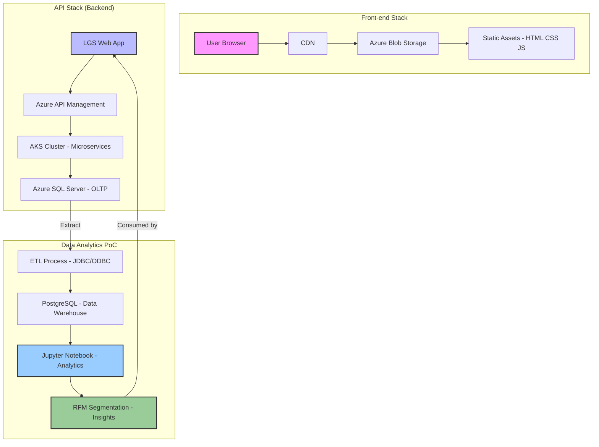

markdown

# Project: Python Data Analytics (LGS) PoC

## Introduction

### Business Context
LGS is a UK based giftware retailer looking to move beyond intuition based marketing and embrace data driven decision making. With a rich transactional history spanning over a million records, the company has an opportunity to unlock hidden patterns in customer behaviour, seasonal trends, and product performance. This proof of concept (PoC) demonstrates how advanced analytics can turn raw sales data into actionable business intelligence.

### How LGS Will Use These Analytics
The insights derived from this project will directly support several strategic initiatives:

- **Targeted Marketing Campaigns**  Segment customers based on purchasing behaviour to deliver personalised promotions and offers.
- **Customer Retention**  Identify At Risk and Lost segments early and launch re engagement programs.
- **Product Assortment Optimisation**  Pinpoint best selling items and seasonal favourites to guide inventory purchasing.
- **Revenue Growth**  Focus marketing spend on high value segments (e.g., Champions) while nurturing Potential Loyalists with up sell and cross sell tactics.
- **Operational Insights**  Monitor monthly sales trends, cancellation patterns, and active user counts to inform business planning.

### Technologies Used
- **Python 3.8+** with **Pandas**  data wrangling, aggregation, and transformation.
- **Jupyter Notebook**  interactive development environment for exploratory analysis and visualisation.
- **PostgreSQL**  relational database storing the source transactional data.
- **SQLAlchemy**  ORM and database connectivity.
- **Matplotlib & Seaborn**  data visualisation and charting.
- **Docker**  containerised development environment ensuring consistency and reproducibility.

---

## Implementation

### Project Architecture

The solution follows a modular, containerised architecture that separates data storage, processing, and analysis.

**High level components:**

1. **Data Sources**
   - **PostgreSQL container (`jarvis-psql`)**  holds the primary `retail` table.
   - **CSV exports**  alternative source for testing and validation, provided by LGSs IT team.

2. **Data Integration Layer**
   - **Docker bridge network (`jarvis-net`)**  enables secure communication between the Jupyter and PostgreSQL containers.
   - **SQLAlchemy engine**  connects Jupyter to the database using container hostnames.

3. **Analysis & Wrangling Layer**
   - **Jupyter Notebook (`jarvis-jupyter`)**  runs the `retail_data_analytics_wrangling.ipynb` notebook.
   - **Pandas DataFrames**  used for cleaning, transformation, and feature engineering.
   - **Statistical & RFM modelling**  customer segmentation and KPI calculations.

4. **Output & Reporting Layer**
   - **Visualisations**  bar charts, histograms, and line plots that summarise trends and segment distributions.
   - **Segment summaries**  actionable tables that categorise customers into 11 RFM based groups.

5. **Future Integration**
   - The analytics outputs can be exposed via a **web application** (e.g., a dashboard) for LGS stakeholders, enabling real time monitoring and ad hoc querying.

---

### Data Analytics and Wrangling

The complete analytical workflow is documented in the Jupyter notebook:  
**[`./python_data_wrangling/retail_data_analytics_wrangling.ipynb`]**.

This notebook performs the following key tasks:

- **Data Preparation**  standardises column names, converts data types, and handles missing values.
- **Exploratory Analysis**  examines invoice distributions, monthly sales, cancellation rates, and active user trends.
- **Customer Segmentation (RFM)**  computes Recency, Frequency, and Monetary scores for each customer, then assigns them to one of 11 segments (e.g., Champions, At Risk, Lost).

#### How These Insights Increase Revenue

The analysis directly enables LGS to design data driven strategies:

| Segment | Count | Avg. Spend | Strategy |
|---------|-------|------------|----------|
| **Champions** | 1,478 | £8,018 | Reward with exclusive previews, loyalty perks, and referral incentives to maximise lifetime value. |
| **Loyal Customers** | 527 | £3,237 | Deepen engagement with personalised product recommendations and early access promotions. |
| **Potential Loyalists** | 737 | £901 | Encourage more frequent purchases through bundling and volume discounts. |
| **At Risk** | 891 | £1,340 | Launch re engagement campaigns (e.g., We miss you) with targeted discounts. |
| **Lost** | 527 | £218 | Use win back offers and surveys to understand why they left and attempt reactivation. |

Additionally, the monthly sales and new vs existing user charts highlight seasonality and acquisition effectiveness, allowing LGS to:

- Adjust marketing spend during peak months.
- Plan product launches to coincide with high activity periods.
- Measure the success of acquisition campaigns by tracking new user counts.

---

## Improvements

Given more time, the following enhancements would be implemented to extend the PoC into a production ready system:

### 1. Automated ETL Pipeline
Replace the manual notebook execution with an orchestrated workflow (e.g., using **Apache Airflow** or **Prefect**).  
- Schedule daily extraction from the production database.  
- Automate data cleaning, RFM scoring, and segment updates.  
- Trigger alerts when key metrics (e.g., churn rate) deviate from thresholds.

### 2. Integration with External Data Sources
Enrich the analysis by combining transactional data with:
- **Marketing campaign metadata**  to measure ROI per segment.
- **Customer demographics**  for deeper personalisation.
- **Competitor pricing**  to optimise price positioning.
- **Social media sentiment**  to gauge brand health.

### 3. Predictive Modelling
Develop machine learning models to:
- **Forecast customer churn**  proactively target at risk individuals.
- **Predict next purchase date**  time promotions for maximum impact.
- **Recommend products**  using collaborative filtering and association rules to increase basket size.
- **Estimate lifetime value (CLV)**  prioritise high potential customers.

---

## Technical Constraints

- **Data Quality**  CSV exports may contain inconsistent formats; thorough validation is required before analysis.
- **Performance**  The dataset (~1.07M rows) fits comfortably in Pandas, but larger volumes would require distributed processing (e.g., Dask or Spark).
- **Data Privacy**  All customer IDs and transaction details must be handled in accordance with GDPR and LGS internal policies.
- **Container Networking**  Proper Docker network configuration is essential for connectivity between containers.
- **Development vs. Production**  The Jupyter environment is suitable for development; a production deployment would require converting the logic into a modular application (e.g., using Python scripts and scheduled jobs).

---

